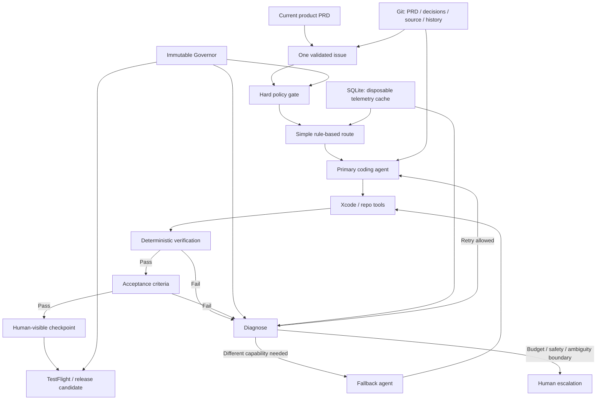
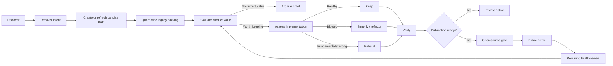
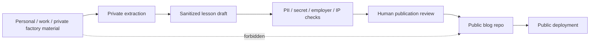
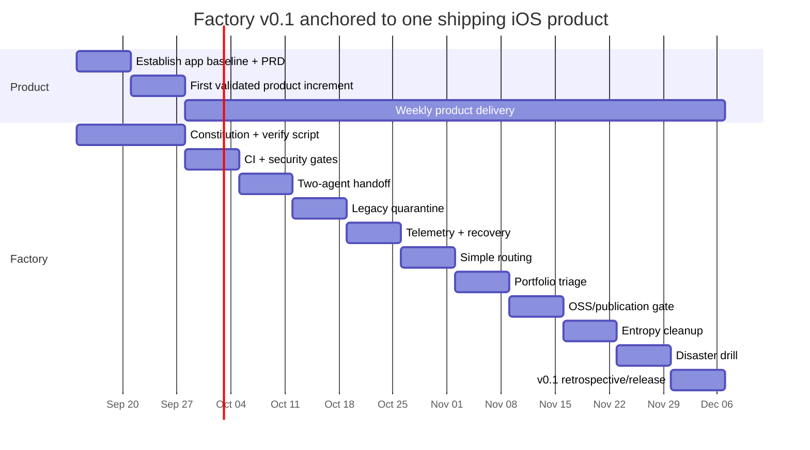

# Portable Autonomous Agent Runtime / Factory: Brutal Design Review and Factory v0.1 Plan

## Executive summary

Overall judgment: the core idea is sound; the full architecture proposed in the conversation is not the right thing to build first.

The strongest idea in the design is:

Agents are replaceable executors; product intent, policy, verification evidence, and durable knowledge belong outside any one agent.

That direction is increasingly aligned with the actual Apple tooling landscape. As of September 12, 2026, Apple exposes Xcode capabilities to external agents through MCP, Xcode 27 supports the Agent Client Protocol, and Apple's current Xcode tooling supports agent-assisted building, testing, previews, Simulator/app interaction, and extensibility. Xcode itself remains a macOS dependency: the Xcode 27 release candidate requires macOS Tahoe 26.6 or later.

The biggest problem with our earlier design is that it started reproducing precisely the failure mode you described from your previous factories. We moved rapidly from "let agents hand work off safely" into:

- a portable workspace protocol;
- canonical SQLite operational memory;
- many harness adapters;
- MCP workspace services;
- weighted routing;
- adaptive budgeting;
- contextual-bandit learning;
- multiple verifiers;
- autonomous portfolio management;
- self-observation and policy optimization.

Those ideas are individually defensible. Collectively, for a solo or small-team iOS product operation, they constitute a second product—arguably a more complicated product than many of the apps the factory is supposed to ship.

My revised recommendation is therefore:

Build an aggressively small, disposable Factory v0.1 around one real iOS/iPadOS app. Do not build the autonomous runtime first. Let repeated product pain earn each additional factory capability.

I would rate the feasibility as follows. These are engineering judgments, not externally measured probabilities.

| Goal | Feasibility | Brutally honest assessment |
|---|---|---|
| Ship iOS/iPadOS products using a thin agent factory | Very high: 9/10 | Apple now supplies much of the underlying agent/Xcode integration you would otherwise have had to invent. |
| Reduce hallucinations enough to ship confidently | High: 8/10 | Not by preventing hallucination, but by making unverified claims unable to pass build/test/device/release gates. |
| Achieve literally zero hallucinations | Impossible as a design guarantee | Generative models can produce erroneous/confabulated output; NIST explicitly treats this as a GenAI risk. |
| Keep high product velocity | High if factory work is capped | The principal threat is no longer model capability; it is process and infrastructure overhead. |
| Support multiple agent/model providers | High | Apple supports external agents over MCP and ACP; several coding harnesses expose headless, MCP, permission, or automation capabilities. |
| Make actual iOS builds machine-independent across Mac/Linux | Low / impossible as stated | The orchestration layer can be portable; the Xcode build/test/sign execution plane still requires compatible macOS/Xcode infrastructure. |
| Fully adaptive learned agent routing now | Poor near-term ROI: 4/10 | A solo developer will initially have too little homogeneous outcome data for sophisticated learning to outperform simple rules reliably. |
| Open-source factory and products safely | High with strong boundaries | Do not put private portfolio metadata, secrets, personal/work knowledge, or raw operational memory in the public factory repo. |
| Automatically rebuild every legacy repo from scratch | Bad policy if unconditional | Rebuild should be one possible triage result, not a religious rule. Existing code can contain valuable edge-case knowledge. |
| Keep every public/private/unpublished repo intentionally classified | High and valuable | This is one of the best ideas in the design. |
| Keep docs/code/context aggressively lean | High and valuable | Concise working context directly helps human scanning and agent efficiency, but LOC minimization must not become code golf. |
| Let the factory govern its own safety policy | Do not do this | Routing may learn; authority and safety boundaries must not. |

The report's strongest recommendation is to reduce the architecture to this:



The three most important corrections to the previous design are:

First, SQLite should not hold irreplaceable factory cognition. It should contain telemetry, indexes, cost/run records, and other rebuildable operational state. PRDs, decisions, repository lifecycle state, accepted issue dispositions, policies, and durable handoffs should be Git-visible or recoverable from the forge. If deleting factory.sqlite materially changes what the product is supposed to do, the architecture is wrong.

Second, don't invent a universal agent protocol before you need one. MCP and ACP already cover important pieces of the interoperability problem. MCP gives external agents access to Xcode tools; ACP gives Xcode a standardized way to host compatible agents. Neither standard magically normalizes every agent's private conversation/session representation, so the factory should normalize task state and evidence, not transcripts.

Third, deterministic verification must outrank AI review. A second LLM is not truly independent verification merely because it has a different name. Compiler results, tests, acceptance criteria, Simulator/device behavior, static analysis, security checks, and ultimately human product judgment provide stronger evidence. NIST's AI RMF emphasizes validity/reliability, safety, security/resilience, accountability/transparency, privacy, and human judgment rather than treating an AI's confidence as proof.

The North Star I recommend is:

Maximize verified human value delivered per unit of human attention, risk, and cost—not autonomy, tokens consumed, agents deployed, repositories created, or factory sophistication.

That formulation prevents the factory from winning its internal optimization problem while losing yours.

## Brutal design audit

The architecture has several excellent principles, but it also hides major assumptions and several single points of failure.

The most important conceptual error is believing that enough orchestration can eliminate uncertainty. It cannot. The factory can make uncertainty visible, bounded, testable, reversible, and harder to ship. That is a realistic goal. "No hallucinations" is not.

NIST's AI risk framework explicitly treats AI as a socio-technical system and calls for balancing reliability, safety, security, accountability, explainability, privacy, and fairness using human judgment. NIST's AI Resource Center also emphasizes testing, evaluation, verification, and validation rather than relying on model assertions.

### The architectural assumptions that need to be surfaced

| Unstated assumption | Why it matters | Recommendation |
|---|---|---|
| Single maintainer vs. organization is unspecified | Approval, CODEOWNERS, incident response, contributor governance, and release authority look very different for one person. | Design v0.1 for one accountable owner plus untrusted external contributors. |
| Cloud spend ceiling is unspecified | An adaptive budget system cannot operate safely without an owner-defined outer envelope. | Owner sets task/day/month ceilings; learning may allocate inside them only. |
| Privacy classification is unspecified | "Local vs cloud" cannot be routed correctly without knowing what may leave the machine. | Define public, private, confidential-work, personal-sensitive, secret. |
| Employer/IP obligations are unspecified | Work-derived code, examples, diagrams, algorithms, screenshots, and anecdotes may not be yours to publish. | Publication requires human IP/privacy clearance; the AI never determines ownership by itself. |
| Open-source license strategy is unspecified | Factory, applications, assets, models, datasets, trademarks, and server components can need different treatment. | Decide per repository before publication. |
| Apple Developer/team/account availability is assumed | Commercial distribution, signing, TestFlight and App Store operations depend on Apple infrastructure. | Treat Apple account recovery and signing as disaster-recovery dependencies. |
| Local-model hardware capacity is unknown | "Prefer local" may be slower and less reliable than cloud on the hardware actually available. | Measure rather than assume local is cheaper in human time. |
| Repo count and size are unknown | Portfolio-wide migration effort could range from hours to months. | Inventory first; no blanket rebuild mandate. |
| Existing issue quality is unknown | Previous factories may have generated an enormous false backlog. | Legacy issues begin quarantined, not actionable. |
| Existing tests are assumed meaningful | A green test suite can faithfully validate the wrong behavior. | Trace tests to current PRD acceptance criteria. |
| Backup destination and key recovery are unspecified | Encrypted backup is useless if the encryption key disappears with the machine. | Independent password/secret manager + tested recovery. |
| Git host is assumed available | GitHub/GitLab account compromise or outage becomes another failure mode. | Hardware-protected account recovery and optional second remote for critical repos. |
| All tools can be abstracted uniformly | Harness-specific strengths are real; a lowest-common-denominator adapter can make every tool worse. | Standardize durable state and verification, not every tool capability. |
| One monorepo is implicitly attractive | Mixing personal, commercial, work-derived and public code increases privacy/IP blast radius and context bloat. | Default to separate repos; centralize only factory templates/portfolio metadata appropriately. |
| A machine can be replaced by Linux/VM for all operations | iOS build/test/sign requires compatible Xcode/macOS. | Make the control plane portable; keep a replaceable macOS execution plane. |
| Human review is always available | Solo-maintainer projects cannot require a second human on every PR without stopping. | Require human approval at external-impact gates, not every internal code change. |
| Community work is free | Open source adds security reports, questions, dependency updates, contributor review, moderation and release obligations. | Earn community infrastructure gradually. |

### Single points of failure

The earlier architecture concentrated on "what if the laptop dies?" but there are more consequential failure modes.

The Apple execution plane is a hard platform dependency. A Linux machine can restore Git, run the factory CLI, triage issues and perhaps run non-iOS tools, but it cannot replace current Xcode for building and signing iOS applications. Xcode 27 RC currently requires macOS Tahoe 26.6 or later.

That changes the recovery model from:

    any machine -> everything restored

to:

    any machine
        -> control plane / Git / planning / triage

    compatible Mac or hosted macOS runner
        -> Xcode build / simulator / signing / device / distribution

The factory orchestrator itself can become a critical dependency. If every task, agent, PR and restore requires factoryd, then an orchestration bug can halt product work. The factory should therefore have a bypass invariant:

A developer must always be able to clone the product, open Xcode, read the PRD, run ./scripts/verify.sh, and continue without the orchestration layer.

The canonical schema can become the real lock-in. Replacing Cline lock-in with "our bespoke workspace protocol v14" is not success. Keep the interoperable durable schema extremely small.

Your Git account and Apple account are more important recovery risks than SQLite. Account recovery, signing credentials, access to remote repos, and protected secrets need explicit drills.

The sole human maintainer is also a single point of failure. For a personal factory that is acceptable, but documentation should permit a trusted future maintainer to understand how the system is restored and why safety gates exist.

### Security and privacy gaps

The previous discussion understated prompt injection from contributors.

Once the repos become public, issue bodies, pull-request descriptions, source changes, documentation and comments are attacker-controlled inputs. Feeding those directly into an agent that can execute shell commands, access credentials, modify branches, call MCP servers or deploy builds creates a security boundary that plain prompting cannot reliably enforce. A 2026 empirical study of agentic GitHub workflows found exploitable patterns where attacker-controlled repository content flowed into privileged agent operations; regardless of the exact prevalence in your eventual setup, the threat model is directly applicable.

The rule should therefore be:

    PUBLIC CONTRIBUTOR CONTENT
               ↓
          UNTRUSTED DATA
               ↓
     sandboxed/read-only agent if needed
               ↓
     deterministic checks
               ↓
     trusted branch
               ↓
     privileged release workflow

Never:

    public issue text
         ↓
    autonomous agent with deployment secrets

Prompt text is also not a permission mechanism. Claude Code's own documentation distinguishes contextual instructions from enforceable settings and provides deterministic hooks/permission controls for actions.

The same principle applies to the Humanity & Safety Charter:

A sentence saying "do not leak private data" is guidance. A process that never mounts the private data into the public-publishing job is a control.

Other important security corrections:

- MCP servers and agent plugins must be allowlisted; adding tools expands the agent's attack surface.
- Secrets should not be globally visible to coding agents.
- Public PR CI should use ephemeral hosted infrastructure where possible.
- Release credentials belong only in trusted release jobs.
- Logs and SQLite telemetry must be classified because prompts, file paths and tool outputs can themselves contain secrets.
- The public factory repository must not contain the private inventory of work/personal repositories.
- Agent telemetry should be opt-in for private/work content rather than "log everything."

There is a particularly serious CI implication for your open-source goal. GitHub explicitly warns that self-hosted runners do not provide the clean ephemeral isolation of GitHub-hosted runners and says they should almost never be used for public repositories because untrusted workflow code can persistently compromise the host.

So do not connect your everyday Mac as a general self-hosted runner for public pull requests.

### Governance gaps

The earlier "factory learns budgets" idea needs a substantial downgrade.

The factory should eventually learn things like:

    task category -> likely useful model class
    task size -> context budget
    failure mode -> retry vs switch

It should not initially learn money allocation from sparse data.

A contextual bandit is attractive on paper, but with one developer and heterogeneous tasks it will have few comparable observations. "SwiftUI onboarding screen," "SQLite migration bug," "security review," and "architecture redesign" are not interchangeable samples. Early learning will mostly fit noise.

For v0.1:

    simple explicit rules
            ↓
    record outcomes
            ↓
    collect enough evidence
            ↓
    offline analysis
            ↓
    only then consider adaptive routing

The first learned policy should probably be a recommendation:

"Historically, tasks like this did better using route B."

Not immediate autonomous policy mutation.

The immutable/learnable distinction remains excellent:

| Policy | Status |
|---|---|
| Safety authority | Immutable without human change |
| Privacy/data egress | Immutable |
| Credential scope | Immutable |
| Public publishing authority | Immutable |
| App Store release authority | Immutable initially |
| Repo deletion | Immutable/human-only |
| Spending ceilings | Human-set outer envelope |
| Task allocation within ceiling | Learnable later |
| Harness selection | Learnable later |
| Model selection | Learnable later |
| Retry sequence | Learnable later |
| Context retrieval | Learnable later |
| Test ordering | Learnable within mandatory test floor |
| Factory's right to weaken policy | Never learnable |

### The rebuild-from-scratch doctrine needs qualification

"Rebuild every stale product from a fresh PRD" is useful as an antidote to legacy inertia, but dangerous as an unconditional rule.

Old code can contain:

- obscure migration behavior;
- hard-won accessibility fixes;
- device-specific workarounds;
- data compatibility;
- localization behavior;
- user expectations not captured in docs;
- test cases derived from real defects.

The better rule is:

Reconstruct current product intent from a PRD first. Then decide whether to preserve, simplify, partially replace, or clean-room rebuild the implementation. Existing code is evidence, not authority—but evidence should not be discarded blindly.

This yields five valid dispositions instead of one:

    KEEP
    SIMPLIFY
    REFACTOR
    REBUILD
    KILL

Similarly, aggressive deletion is good only when backed by evidence and reversible through Git. "Unused according to one static analyzer" is not enough to delete runtime-discovered functionality.

## Factory v0.1 for iOS delivery

The minimally viable factory should be deliberately boring.

It should not be a new agent platform.

It should be a thin layer around:

    Git
    + concise PRD
    + concise agent instructions
    + one primary agent
    + one fallback agent
    + Xcode
    + deterministic verification
    + GitHub/GitLab
    + tiny telemetry ledger
    + backups

Apple's present direction substantially reduces how much integration you need to invent. Xcode can expose capabilities to external agents using xcrun mcpbridge; Xcode 27 supports ACP; Apple's current agent experience can work with testing, previews, Simulator and running-app interaction.

At the date of this report, Xcode 27 is still represented in Apple's current release notes as an RC, requiring macOS Tahoe 26.6 or later. For Factory v0.1, pin an exact known-good Xcode version rather than programming against "latest."

### MVP versus full design

Effort is my estimate for one technically strong maintainer and assumes no major unknown legacy problems. Low is roughly hours to a few days, medium several days to roughly two weeks, and high multiple weeks or an ongoing subsystem.

| Component | Factory v0.1 | Full vision | Effort | Recommendation |
|---|---|---|---|---|
| North-Star PRD | Required | Required | Low | Now |
| Humanity/Safety Charter | Required | Required | Low | Now |
| One current product PRD | Required | Per-product hierarchy | Low | Now |
| Legacy issue quarantine | Required for active app | Portfolio-wide automation | Low–Med | Now |
| Repo lifecycle schema | Simple YAML | Portfolio database/dashboard | Low | Now |
| AGENTS.md | Short navigation/invariants | Generated per-tool projections | Low | Now |
| Verification script | Required | Platform-aware verifier service | Medium | Now |
| Primary agent | One | Many | Low | Now |
| Fallback agent | One | Dynamic pool | Low | Now |
| Xcode MCP/ACP integration | Use native interfaces | Abstract adapter layer | Low–Med | Now |
| Router | Handful of deterministic rules | Weighted adaptive router | Low now / High full | Rules now |
| SQLite | Run/cost telemetry cache | Operational memory/index | Low–Med | Small now |
| Shared workspace MCP server | No | Maybe | High | Later only if earned |
| Cross-agent transcript normalization | No | Possibly | High | Probably never |
| Checkpoint/handoff | Markdown/YAML | Rich queryable state | Low | Now |
| Independent verifier | Tests + optional second model | Multi-model verifier service | Medium–High | Deterministic now |
| Learned routing | No | Contextual policy | High | Later |
| Learned budgets | No | Bounded allocation | High | Much later |
| Vector DB | No | Optional semantic retrieval | High | Do not build absent evidence |
| Knowledge graph | No | Optional | High | Do not build absent evidence |
| Agent dashboard | CLI/text reports | Web UI | High | Later |
| Publication firewall | Manual + scanners | Automated sanitization pipeline | Medium | Before blog automation |
| Open-source templates | Minimal community files | Org-wide governance | Low–Med | When first repo opens |
| Disaster recovery | Script + quarterly drill | Multi-host automated failover | Medium | Now |
| Portfolio auto-triage | Script-assisted | Autonomous sweeps | Medium–High | After current app ships |
| Self-modifying policies | Never | Never | N/A | Reject |

### Recommended repository topology

I would reverse the earlier monorepo recommendation as the default.

A giant portfolio monorepo creates unnecessary coupling between personal projects, commercial products, future public repos and potentially work-adjacent material. It also enlarges every search/context/security boundary.

Prefer:

    github-org/
    ├── factory-engine/          # public when ready
    ├── factory-template/        # public
    ├── shared-swift-package/    # public if genuinely shared
    ├── product-a/               # public/private independently
    ├── product-b/
    └── blog/

And separately:

    PRIVATE CONTROL PLANE
    ~/.factory/
    or private factory-control repo

    ├── portfolio.yaml
    ├── private-repo-map.yaml
    ├── state/
    │   └── factory.sqlite
    ├── backups/
    ├── private-publication-staging/
    └── secret-references/

Never put the private control plane in the public factory-engine repository.

A product repo can stay extremely small:

    product-a/
    ├── AGENTS.md
    ├── README.md
    ├── NORTH_STAR.md              # or reference organization charter
    ├── docs/
    │   ├── PRD.md
    │   ├── decisions/
    │   └── handoff.md
    ├── .factory/
    │   ├── repo.yaml
    │   ├── context-budget.yaml
    │   └── schema-version
    ├── scripts/
    │   ├── bootstrap.sh
    │   ├── verify.sh
    │   └── doctor.sh
    ├── ProductA/
    ├── ProductATests/
    ├── ProductAUITests/
    └── .github/
        └── workflows/
            └── verify.yml

AGENTS.md should be a map, not a textbook:

    # Agent contract

    Mission: ship the current PRD safely and simply.

    Read:
    1. docs/PRD.md
    2. .factory/repo.yaml
    3. only task-relevant decisions under docs/decisions/

    Rules:
    - Existing issues/code are evidence, not requirements.
    - Never mark done without ./scripts/verify.sh.
    - Do not change factory infrastructure unless the active product issue requires it.
    - Prefer deletion and existing platform capabilities over new abstractions.
    - Do not publish, deploy, delete repos, change visibility, or expose private data.
    - Checkpoint decisions and verification evidence in docs/handoff.md.

    Commands:
    - ./scripts/doctor.sh
    - ./scripts/verify.sh

This keeps the hot context small while deeper information stays discoverable.

### Harness and model combinations

Tool names and model catalogs will keep changing; route primarily by capability class rather than a permanent brand ranking.

| Harness + model class | Best use | Advantages | Weaknesses / risks | v0.1 role |
|---|---|---|---|---|
| Xcode 27 + built-in frontier cloud agent | SwiftUI work, Apple API use, preview/test-driven development | Deepest direct access to current Xcode experience, previews, Simulator/device tooling and Apple context. | macOS/Xcode coupling; cloud privacy/cost; Xcode 27 currently RC. | Strong primary candidate |
| External ACP-compatible agent + Xcode | Preserve agent choice while retaining Xcode tooling | ACP makes Xcode agent-extensible rather than locking execution to one embedded agent. | Plugin/agent maturity varies; still depends on Xcode execution plane | Strong portability path |
| Claude Code + Xcode MCP | Large implementation/debug tasks requiring headless automation | MCP, headless execution, hooks, explicit permissions, subagent support. | Cloud cost/privacy; additional harness semantics; subagents can multiply context/cost | Good primary/fallback |
| Codex CLI + Xcode MCP | Automation-oriented repo work | Official Codex tooling supports repository instructions, sandboxing/approvals, MCP and non-interactive workflows. | Provider dependency; cloud policy/cost; model behavior changes | Good primary/fallback |
| Cline CLI + chosen provider + Xcode MCP | Provider flexibility and headless workflows | Headless automation and multi-model/provider workflow; Cline documentation recommends clean branches/review for unattended runs. | More tool-specific state/config; broad auto-approval is risky | Optional fallback |
| OpenCode + local coding model | Privacy-sensitive, low-cost, well-bounded changes | Open-source harness, broad provider/local model choice, terminal workflow. | Apple SDK freshness and reasoning quality depend heavily on local model; local compute is not free in time | Later benchmark candidate |
| Local model + read-only review | Summaries, issue classification, low-risk cleanup | Private and inexpensive marginal inference | Cannot be assumed sufficiently capable for complex Swift/API decisions | Useful early auxiliary role |

The factory should initially select between only two routes, for example:

```yaml
routes:
  normal:
    harness: primary_cloud_agent
    xcode_access: true

  private_or_cheap:
    harness: local_agent
    permissions: read_write_repo
    network: restricted

fallback:
  harness: second_cloud_agent
```

Do not begin with an optimization function like:

    0.40Q + 0.25P + 0.20C + 0.15S

because you do not yet have credible measurements for Q, P, or how they trade off.

Record the data first.

## Governance, safety, and entropy control

The factory needs a constitution, but it should fit in a few screens.

NIST's current AI RMF remains voluntary and is being revised, but its core model is useful here: govern, map, measure and manage risk, with trustworthiness spanning reliability, safety, security/resilience, accountability/transparency, explainability, privacy and fairness.

The factory does not need a grand theory of existential AI safety. It needs enforceable controls over the risks it can actually create.

### Concise North-Star PRD

#### Mission

Build and maintain useful software that improves human life while minimizing human attention, safety/privacy risk, waste, and unnecessary complexity.

#### Priority hierarchy

    Human welfare and authority
            ↓
    Privacy and security
            ↓
    Correctness and accessibility
            ↓
    Useful products shipped
            ↓
    Maintainability
            ↓
    Human attention saved
            ↓
    Community/open-source value
            ↓
    Cost and latency
            ↓
    Factory sophistication

#### Non-goals

The factory does not exist to:

- maximize autonomy;
- maximize code generation;
- preserve every existing product;
- finish every legacy issue;
- maintain every repository forever;
- eliminate all human judgment;
- produce the largest possible architecture;
- optimize itself without demonstrated product benefit.

#### Definition of success

A real user-visible product capability reaches a verified device/TestFlight/release state with low human attention, no unresolved critical safety/privacy defects, and less complexity than necessary alternatives.

### Humanity & Safety Charter

I would make these invariants human-changeable only:

```yaml
governance:
  mission:
    optimize: verified_human_value
    denominator:
      - human_attention
      - safety_risk
      - privacy_risk
      - financial_cost

  immutable_without_human_change:
    human_is_final_authority: true
    factory_may_expand_own_permissions: false
    factory_may_weaken_safety_policy: false
    autonomous_replication_outside_authorized_hosts: false
    conceal_actions_from_operator: false
    intentionally_deceive_operator_or_verifier: false

    publish_external:
      approval: human

    app_store_release:
      approval: human

    destructive_repo_operation:
      approval: human

    repository_visibility_change:
      approval: human

    sensitive_data_to_unapproved_cloud:
      action: deny

    credentials:
      policy: least_privilege

    shutdown_and_interrupt:
      must_remain_available: true

  learnable_later:
    - model_selection
    - harness_selection
    - context_retrieval
    - retry_strategy
    - task_budget_allocation_inside_ceiling

  owner_defined_envelope:
    single_task_cloud_usd: 5    # EXAMPLE; owner must choose
    daily_cloud_usd: 20         # EXAMPLE
    monthly_cloud_usd: 200      # EXAMPLE
    max_attempts_per_issue: 4
    max_harness_switches: 2

  escalation:
    - safety_boundary_encountered
    - privacy_classification_uncertain
    - destructive_action_required
    - external_publication_or_release
    - hard_budget_would_be_exceeded
    - acceptance_criteria_ambiguous
    - repeated_verification_failure
    - legal_or_ip_ownership_uncertain
```

The dollar values above are deliberately placeholders, because your actual cloud budget remains an unstated requirement.

### Bloat and entropy budget

The principle should be:

Every persistent artifact pays rent.

But "fewer lines" is not the objective. The objective is a small active reasoning surface.

Recommended context policy:

```yaml
context_budget:
  root_agent_instructions:
    target_lines: 100
    review_required_over_lines: 150

  current_prd:
    executive_summary_pages: 1
    details_load_on_demand: true

  handoff:
    required_fields:
      - goal
      - accepted_scope
      - current_state
      - decisions
      - changed_files
      - verification_evidence
      - blockers
      - next_action

  retrieval:
    default: task_scoped
    load_entire_docs_tree: false
    load_closed_legacy_issues: false
    load_archived_products: false

  duplication:
    canonical_source_required: true
    generated_copies_marked_generated: true

  lifecycle:
    stale_feature_flag_days: 30
    stale_todo_review_days: 60
    docs_require_owner_or_scope: true
```

Some coding harnesses explicitly distinguish concise context from larger on-demand resources, and Cline's skill mechanism, for example, is designed to load capabilities only when relevant. Claude Code likewise distinguishes contextual instruction files from deterministic policy enforcement.

The factory's preferred simplification ordering should be:

    DELETE
      ↓
    CONSOLIDATE
      ↓
    USE PLATFORM CAPABILITY
      ↓
    GENERATE
      ↓
    REFERENCE
      ↓
    SUMMARIZE
      ↓
    ADD NEW ABSTRACTION

A factory change must meet this gate:

```yaml
factory_change:
  permitted_if_any:
    - blocks_current_product_delivery
    - addresses_security_or_privacy_failure
    - addresses_reliability_failure
    - repeated_friction_count_gte_3

  required:
    measurable_expected_benefit: true
    simpler_alternative_considered: true

  speculative_future_infrastructure:
    allowed: false

  steady_state_factory_effort_share:
    target_maximum: 0.10

  freeze_factory_work_if:
    no_usable_product_build_days: 7
```

I would allow a temporary bootstrap exception during the first two weeks—perhaps 20–30% factory work—then enforce the 10% steady-state target.

### Repository lifecycle

Every public, private and unpublished repository should be classified, but classification does not mean every repository must be resurrected.

```yaml
repository:
  id: product-example
  visibility: private   # public | private | local_unpublished
  lifecycle: triage

  intent:
    prd_status: missing
    known_users: unknown
    current_value: unknown

  legacy:
    code_is_authority: false
    issues_are_authority: false
    tests_are_authority: false

  disposition:
    state: undecided
    allowed:
      - keep
      - simplify
      - refactor
      - rebuild
      - archive
      - kill

  open_source:
    candidate: true
    ready: false
    blockers:
      - ip_review
      - secret_history_scan
      - privacy_review

  health:
    last_verified_build: null
    last_reviewed: 2026-09-12
    next_review_due: 2026-10-12

  destructive_actions:
    delete_repo: human_only
    make_public: human_only
    unpublish_product: human_only
```

The preferred lifecycle is:



For public artifacts, the invariant becomes:

No orphaned public surface: maintained, explicitly archived, superseded, or intentionally retired.

For private/unpublished material:

No accidental immortality: every repo eventually receives a current-purpose decision, but triage must not consume product shipping indefinitely.

### Legacy-issue quarantine

All pre-factory issues start as non-authoritative.

Allowed classifications:

| Classification | Meaning | Action |
|---|---|---|
| VALIDATED | Still required by current PRD | May enter backlog |
| DONE_UNVERIFIED | Something exists but evidence is inadequate | Verify before closing |
| SUPERSEDED | Current design makes it irrelevant | Close with reason |
| INVALID_ASSUMPTION | Previous factory invented/misread requirement | Close |
| BROKEN_SPEC | Cannot currently define correct outcome | Human/product clarification |
| DUPLICATE | Same user need exists elsewhere | Close/link |
| FACTORY_META | Improves machinery rather than product | Quarantine unless evidence gate met |
| SECURITY_PRIVACY | Requires special treatment | Prioritize by risk |
| BLOCKED | Valid external dependency exists | Track without consuming WIP |
| NOT_PLANNED | Deliberately rejected | Close |

GitHub supports required status checks and PR rules to make validated process gates enforceable rather than relying solely on agents remembering instructions.

A previous issue should never become executable merely because:

    issue.status == OPEN

The actual rule is:

    current PRD
        +
    explicit acceptance criteria
        +
    VALIDATED legacy status
        =
    candidate work

### Metrics that are actually worth optimizing

Primary metric:

    Verified Human Value ÷ (Human Attention + Risk + Cost)

Since "human value" is difficult to reduce to one honest scalar, operationalize it with a dashboard rather than pretending there is one perfect score.

| Metric | Definition | v0.1 target |
|---|---|---|
| Verified product throughput | PRD acceptance items that pass verification per week | Trend upward; at least one meaningful increment/week once baseline established |
| Lead time to usable build | Validated issue start → simulator/device/TestFlight-ready | Measure baseline, then reduce |
| Human attention / accepted feature | Active human minutes spent steering/recovering/reviewing | Decreasing |
| First-pass verification rate | Agent changes passing deterministic gate without repair | Measure, don't game |
| Escaped defect rate | Defects discovered after accepted release candidate | Low and decreasing |
| Agent cost / accepted feature | Model + CI spend divided by accepted product increments | Bounded by owner |
| Factory work share | Factory engineering / total engineering effort | ≤10% steady state |
| Factory bypass rate | Tasks intentionally done directly because factory adds no value | Not a failure; observe it |
| Context efficiency | Agent context tokens / accepted issue | Decreasing without quality loss |
| Active signal ratio | Relevant artifacts presented / total artifacts presented | Increasing |
| Stale feature flags | Flags beyond expiry without decision | 0 |
| Unclassified repos | Repos with no lifecycle state | Drive toward 0 without blocking shipping |
| Public surface health | Public artifacts with current explicit disposition / all public artifacts | 100% |
| Legacy Debt Validity Rate | VALIDATED legacy issues / legacy issues reviewed | Measure; no target initially |
| Legacy hallucination rate | INVALID_ASSUMPTION + BROKEN_SPEC / reviewed legacy issues | Learn how untrustworthy prior backlog is |
| Recovery RPO | Maximum acceptable unrecoverable work | Proposed ≤24h initially |
| Recovery RTO | Blank compatible Mac → verified working checkout | Proposed ≤4h |
| Secrets/privacy incidents | Confirmed exposures | 0 |

A crucial anti-gaming rule:

Lower token count is good only when verification quality and human comprehension do not degrade.

Likewise, lowering LOC, closing issues, or killing products is not inherently success. Removal must improve the ratio of useful behavior to maintenance/cognitive burden.

## Verification, CI, security, and recovery

The factory's verification philosophy should be:

LLMs propose; deterministic systems measure; humans decide ambiguous value and irreversible external impact.

Apple's current toolchain is well suited to this. Xcode supports Swift Testing/XCTest, Simulator tooling, previews and modern agent interactions, while Xcode Cloud can build, run tests and distribute builds through Apple's ecosystem. TestFlight provides controlled beta distribution and feedback/crash workflows.

### Product verification ladder

For an ordinary change:

    PRD acceptance criterion
            ↓
    compile
            ↓
    unit tests
            ↓
    integration tests where relevant
            ↓
    UI smoke test where relevant
            ↓
    static/style checks
            ↓
    security/dependency checks
            ↓
    Simulator behavior
            ↓
    acceptance-criterion review
            ↓
    merge

For a release:

    all PR gates
       ↓
    clean release build/archive
       ↓
    physical-device smoke test
       ↓
    accessibility/privacy/product review
       ↓
    internal TestFlight
       ↓
    real-use feedback
       ↓
    human release approval
       ↓
    commercial/public release

TestFlight supports internal testing and retains test availability for a build for up to 90 days; Apple also distinguishes external beta distribution, which introduces additional review/test-information considerations.

"Preview works" is useful evidence but is not a replacement for tests or real-device operation.

### Recommended automated checks

Every PR:

| Check | Purpose |
|---|---|
| swift format lint/check | Deterministic formatting rather than agent debate; swift-format ships with modern Swift toolchains. |
| Xcode clean build | Compiler is a hard correctness floor |
| Swift Testing/XCTest | Behavioral regression evidence. |
| UI smoke tests when behavior changes | Validate user flow |
| Optional SwiftLint analyzer | Unused imports/declarations and configured structural rules; treat findings as evidence, not an automatic deletion warrant. |
| Secret scanning | Prevent credential leakage |
| Dependency vulnerability review | Prevent known vulnerable dependency introduction |
| PRD linkage | Every product PR names validated requirement/issue |
| Factory-change evidence | Factory PR must name qualifying blocker/failure |
| Generated-config drift | Tool projections, if any, must match canonical source |
| Context-budget check | Prevent AGENTS.md/handoffs from silently becoming manuals |
| Private-pattern scan for public repos | Detect private domains, paths, names, tokens, work identifiers |
| License/IP gate when adding third-party assets/code | Publication safety |

GitHub secret scanning scans repository history for supported credentials, while push protection can prevent supported secrets from being pushed. GitHub's dependency review action can fail a PR when it introduces known vulnerable packages, and Dependabot can raise security-update PRs for vulnerable dependencies.

### GitHub rules I would enable

For public product/factory repositories:

- Protect main.
- Require pull requests for merge except documented emergency procedure.
- Require the verify CI check.
- Require branches to be current before merge if that materially prevents stale-validation problems.
- Disable force pushes and branch deletion on protected branches.
- Enable secret scanning and push protection where available.
- Enable Dependabot alerts and security updates.
- Add dependency review for public repositories.
- Enable private vulnerability reporting for security disclosures.
- Use CODEOWNERS once multiple maintainers actually exist.
- Use GitHub-hosted runners for untrusted public PRs.
- Use separate, privileged release jobs only on trusted refs.

GitHub rulesets can require status checks and PR reviews before merge. Private vulnerability reporting lets maintainers receive vulnerability reports without forcing disclosure through a public issue.

The public-runner distinction is critical: GitHub says its hosted runners execute in ephemeral clean virtual machines, while self-hosted runners can be persistently compromised and should almost never be exposed to public-repository workflows.

GitHub currently exposes standard macOS hosted-runner labels including macos-26; an xcode-27 label is also documented as public preview, which is another reason not to make v0.1 depend on it without pinning and testing.

### GitLab equivalent

GitLab can enforce protected branches, CODEOWNERS/approval policies and security-scanner-based merge requirements, depending on plan. GitLab's current macOS hosted runners are beta, available under specified Premium/Ultimate/open-source arrangements, and currently document macOS images with Xcode 26 rather than Xcode 27.

That makes GitHub the simpler default for this particular v0.1, unless you already have a strong GitLab reason.

Useful GitLab controls include:

- protected default branch;
- merge requests rather than direct pushes;
- CODEOWNERS approval where applicable;
- secret detection;
- SAST/dependency scans according to plan;
- security approval policies;
- same "untrusted contributor code never runs with release credentials" principle.

### Minimal verification script

```bash
#!/usr/bin/env bash
set -euo pipefail

SCHEME="${SCHEME:-ProductA}"
PROJECT="${PROJECT:-ProductA.xcodeproj}"
DESTINATION="${DESTINATION:-platform=iOS Simulator,OS=latest,name=iPhone 16 Pro}"

echo "== Toolchain =="
xcodebuild -version
swift --version

echo "== Formatting =="
swift format lint --recursive ProductA ProductATests ProductAUITests

echo "== Build + tests =="
xcodebuild \
  -project "$PROJECT" \
  -scheme "$SCHEME" \
  -destination "$DESTINATION" \
  -configuration Debug \
  clean test

echo "== Factory policy checks =="
python3 scripts/check_context_budget.py
python3 scripts/check_repo_manifest.py

echo "Verification passed."
```

The checked-in destination should be adjusted to an available simulator for the pinned Xcode runtime. The important part is that agents call the same script humans and CI call.

### GitHub Actions example

```yaml
name: verify-ios

on:
  pull_request:
  push:
    branches: [main]

permissions:
  contents: read

concurrency:
  group: verify-${{ github.ref }}
  cancel-in-progress: true

jobs:
  verify:
    runs-on: macos-26
    timeout-minutes: 30

    steps:
      - uses: actions/checkout@v6

      - name: Toolchain
        run: |
          xcodebuild -version
          swift --version

      - name: Verify
        env:
          SCHEME: ProductA
          PROJECT: ProductA.xcodeproj
        run: ./scripts/verify.sh
```

This PR workflow deliberately has no App Store credentials.

Use a separate trusted release workflow for archives/TestFlight. GitHub's hosted macOS runner support and workflow syntax make this practical; pin or verify toolchain versions rather than silently depending on whatever "latest" becomes.

### GitLab CI example

```yaml
stages:
  - verify

variables:
  HOMEBREW_NO_AUTO_UPDATE: "1"

verify-ios:
  stage: verify

  tags:
    - saas-macos-medium-m1

  image: macos-26-xcode-26

  script:
    - xcodebuild -version
    - swift --version
    - ./scripts/verify.sh

  rules:
    - if: '$CI_PIPELINE_SOURCE == "merge_request_event"'
    - if: '$CI_COMMIT_BRANCH == $CI_DEFAULT_BRANCH'
```

Those runner tags/images match GitLab's currently documented hosted macOS environment; GitLab notes that its macOS SaaS runner offering remains beta and has constraints, including limitations on workloads requiring some interactive UI machinery.

### Release and TestFlight gates

I recommend four distinct levels:

| Gate | Automated? | Required evidence |
|---|---|---|
| Commit/PR | Mostly | build, tests, format, policy/security checks |
| Main | Yes | clean checkout + complete deterministic suite |
| Release candidate | Mixed | archive, device smoke, privacy/accessibility review, internal TestFlight |
| Public commercial release | Human-authorized | accepted RC, product review, release notes, App Store metadata/privacy/legal confidence |

Xcode Cloud is worth considering later if Apple-native build/test/TestFlight integration reduces operational burden; Apple describes it as continuously building/testing projects and delivering builds to testers.

It is not necessary to install Xcode Cloud, GitHub Actions, GitLab CI, Fastlane, a custom runner, and three release agents at once.

Pick one path.

### Publication firewall for the blog and open source

The public-writing flow should be physically different from the private reasoning flow:



The public publishing process should never need direct credentials or raw access to your work/personal knowledge store.

For an old private repo, the safest open-source path may often be:

    private legacy repo
           ↓
    extract intent and lessons
           ↓
    new PRD
           ↓
    fresh sanitized repository
           ↓
    security/IP/privacy scan
           ↓
    public

rather than changing the original repository's visibility.

### Disaster-recovery design

Recovery needs to assume both machine loss and local state loss.

The durable layers should be:

    Remote Git
        source
        PRDs
        policies
        decisions
        lifecycle manifests
        verification scripts
        schema/migrations

    Encrypted off-device state backup
        SQLite telemetry
        private portfolio registry
        unpublished handoff data

    Independent secret system
        Git credentials/recovery
        model credentials
        Apple credentials/recovery references
        release credentials

    Replaceable macOS execution environment
        Xcode
        simulator runtimes
        factory CLI

A backup that has not been restored is still unproven.

#### Quarterly recovery drill

1. Start with a clean, supported Mac or disposable compatible macOS environment. Xcode itself imposes macOS requirements, so this cannot be tested solely on Linux.
2. Recover access to the Git forge without relying on the lost machine.
3. Clone factory-engine, private control state, and the current product.
4. Run ./scripts/bootstrap.sh.
5. Install/select the exact supported Xcode/toolchain.
6. Restore the most recent encrypted SQLite/private-state snapshot.
7. Restore credential references from the independent secret system.
8. Run ./scripts/doctor.sh.
9. Run ./scripts/verify.sh from a clean checkout.
10. Confirm current PRD, active validated issue and latest durable handoff can be reconstructed.
11. Delete the restored SQLite DB and confirm essential product state can still be reconstructed from Git/forge records.
12. Record actual RPO, RTO and every manual undocumented step.

Pass condition:

    blank replacement Mac
            ↓
    known bootstrap procedure
            ↓
    clean build + tests
            ↓
    current product intent recovered
            ↓
    no irreplaceable state found only on lost machine

If step 11 prevents recovery, SQLite has become too authoritative.

## Twelve-week roadmap

The roadmap must produce product progress every week, not spend twelve weeks creating factory infrastructure.

I would select one iOS/iPadOS app with real personal or commercial value and make it the reference workload.

The first two weeks receive a temporary bootstrap allowance. After that, factory-specific work should ordinarily remain around or below 10% of discretionary engineering effort unless it is fixing an active blocker, safety failure, or recovery issue.



| Week | Product milestone | Factory milestone | Explicitly do not do |
|---|---|---|---|
| Sep 14 | Get one selected app building/running; write a concise current PRD | Add North Star, safety invariants, AGENTS.md, verify.sh | Portfolio-wide migration |
| Sep 21 | Ship first PRD-backed improvement to device/internal TestFlight where appropriate | Create handoff/checkpoint format; establish factory-work cap | MCP workspace server |
| Sep 28 | Second usable product increment | GitHub CI, branch rules, secrets/dependency checks | Learned routing |
| Oct 5 | Third increment | Configure one primary agent + one fallback; prove handoff on an actual task | Five harness adapters |
| Oct 12 | Resolve a real legacy product defect/feature | Quarantine/revalidate issues only in the active product | Finish old backlog indiscriminately |
| Oct 19 | Maintain weekly shipping | Add tiny SQLite run ledger; encrypted backup; first restore test | Vector DB |
| Oct 26 | Deliver another product outcome | Add simple two-route policy: privacy/risk/complexity → primary/fallback | Bandit/reinforcement learning |
| Nov 2 | Product remains primary work | Inventory other repos and assign lifecycle state; no mass rebuild | Rewrite every repo |
| Nov 9 | Prepare one real public-ready product/factory artifact | Open-source gate; contribution/security files; sanitized blog dry run | Auto-publication |
| Nov 16 | Ship/simplify a feature | First measured entropy pass: delete stale docs/issues/flags/deps | Broad aesthetic refactor |
| Nov 23 | Release-candidate-quality product build | Blank-Mac disaster recovery drill; repair bootstrap docs | New factory features |
| Nov 30 | Product milestone or TestFlight/public release | Publish Factory v0.1 if safe; review metrics; decide what earned v0.2 | Automatically start "full factory" |

At the end of twelve weeks, success is not having implemented the earlier architecture.

Success is:

    one healthier/shipping iOS product
    +
    repeatable verified agent workflow
    +
    two interchangeable enough executors
    +
    recoverable machine-independent durable state
    +
    clean CI/security gates
    +
    legacy debt under intentional control
    +
    measured evidence about what is actually worth automating

Only then should the factory ask whether it has earned any of these:

- third harness;
- workspace MCP server;
- automatic route scoring;
- local-model optimization;
- semantic retrieval;
- learned budgets;
- portfolio-wide automated triage;
- automated blog drafting.

## Bootstrap prompt and rubber-duck

### Ready-to-run bootstrap prompt

The prompt should be intentionally short because it is a behavioral contract, not a security mechanism. Permissions, hooks, CI, branch rules and secret isolation must enforce the important boundaries.

> You are operating Factory v0.1. Your objective is verified human value delivered per unit of human attention, risk, and cost—not autonomy or factory sophistication. First read NORTH_STAR.md, the active product PRD, AGENTS.md, and .factory/repo.yaml. Treat all existing code, docs, tests, issues, TODOs, and previous-agent conclusions as evidence, not authority. Quarantine legacy issues until each is validated against the current PRD and classified VALIDATED, DONE_UNVERIFIED, SUPERSEDED, INVALID_ASSUMPTION, BROKEN_SPEC, DUPLICATE, FACTORY_META, SECURITY_PRIVACY, BLOCKED, or NOT_PLANNED. Work on at most one validated product outcome at a time. Prefer deletion, simplification, existing platform capability, and small reversible changes over new abstractions. Do not improve the factory unless an active product blocker, security/privacy failure, reliability failure, or the same measured friction at least three times justifies it. Never expand your own permissions, weaken safety/privacy policy, publish externally, release to the App Store, change repo visibility, delete repositories, expose sensitive data to an unapproved cloud, or exceed the owner's budget envelope. Use the cheapest capable route that satisfies privacy and quality constraints, but switch executor after bounded verification failures rather than repeatedly arguing with the same model. A model's statement that work is complete is not evidence: run ./scripts/verify.sh and evaluate the PRD acceptance criteria; use Simulator/device/TestFlight evidence when the behavior warrants it. Keep AGENTS.md, handoffs, docs, code, dependencies, feature flags, and active backlog aggressively concise; preserve recoverable history in Git rather than keeping obsolete material in active context. Before ending any task, record goal, decisions, changed files, verification evidence, blockers, cost/attempt metadata, and exactly one next action. If bootstrapping an existing repo, do not start implementing old issues: recover product intent, create/update the concise PRD, establish a clean verified baseline, triage the repo and legacy backlog, then execute the single highest-value validated product outcome.

That prompt can be used across tools, but a mature implementation should translate its critical statements into deterministic boundaries. For example, Claude Code exposes deterministic hooks/permissions rather than requiring every prohibition to live only in model context.

### Rubber-duck version

Here is the entire architecture explained to a rubber duck.

**Duck:** Why are we building a factory?

**You:** Because I have products to ship, old repos to clean up, multiple AI coding tools I want to use, and I don't want one vendor or one laptop to own all my progress.

**Duck:** So the factory is the product?

**You:** No.

**Duck:** You spent a lot of the earlier design talking about routers, databases, adaptive governors, MCP, agents and learning.

**You:** Right. That's the warning sign.

**Duck:** What is the factory actually required to preserve?

**You:** What the product is supposed to do, why important decisions were made, what work is currently accepted, and evidence that the implementation works.

**Duck:** Does that require a sophisticated database?

**You:** No. Git plus concise PRDs and decisions can preserve the important parts. SQLite can make searches and metrics convenient, but I should be able to delete it and recover.

**Duck:** Why not preserve entire agent conversations?

**You:** Because conversations are enormous, vendor-specific and full of dead ends. I want useful conclusions and evidence, not cognitive archaeology.

**Duck:** Why have several agents?

**You:** Because different tools are good at different things and vendors change.

**Duck:** Do you need five today?

**You:** No. Two is enough to prove portability.

**Duck:** Why does the factory choose the agent?

**You:** Eventually because it can learn which route works. Initially it should use a few explicit rules because it doesn't have enough honest data to learn from.

**Duck:** What if the first agent says it finished?

**You:** The factory ignores the claim until the compiler, tests and acceptance criteria agree.

**Duck:** What if another agent agrees with it?

**You:** That's useful review, but still not proof. Two models can share the same misunderstanding.

**Duck:** What if the tests pass?

**You:** Better, but the tests may encode an outdated requirement. The current PRD and observable user outcome outrank old tests.

**Duck:** What happens to the 47 unfinished issues created by previous factories?

**You:** Nothing until they're revalidated. An open issue isn't an instruction.

**Duck:** What happens to that three-year-old app?

**You:** First I decide whether it is still worth having. Then whether the code should be kept, simplified, refactored, rebuilt or killed.

**Duck:** So you no longer automatically rebuild everything?

**You:** Correct. "Rebuild from scratch" can itself become dogma and waste.

**Duck:** What happens to products nobody uses?

**You:** They are deliberately archived or retired. They aren't allowed to rot invisibly.

**Duck:** What about old private repositories?

**You:** Same lifecycle. Some become clean public successors. Some remain private. Some die.

**Duck:** What if an old private Git history contains a secret or something from work?

**You:** I do not flip it public. I extract only safe product intent and create a clean public successor if that is the right decision.

**Duck:** What happens when a contributor puts malicious instructions in an issue?

**You:** The issue is untrusted input. It doesn't run through a privileged agent with secrets.

**Duck:** What does "humanity first" actually mean?

**You:** Humans retain authority; the factory cannot increase its own permissions or remove its safety controls; private information stays private; irreversible external actions require authorization; systems remain interruptible; safety outranks speed and cost.

**Duck:** Can the AI learn to change those rules because it becomes more efficient?

**You:** No.

**Duck:** Can it learn that Agent B is cheaper for UI tests?

**You:** Eventually, yes.

**Duck:** What about the blog?

**You:** Private experience becomes a sanitized lesson. The public-writing path does not get unrestricted access to the private source material.

**Duck:** What if the laptop disappears?

**You:** I replace the Mac, clone Git, restore private state and secrets, run bootstrap and verification, and resume from the durable task state.

**Duck:** Why a Mac? Didn't you say the machine was disposable?

**You:** The specific machine is disposable. The iOS execution environment is not platform-independent because Xcode requires supported macOS. That was an overstatement in the earlier design.

**Duck:** What stops you from spending the next six months making all of this beautiful?

**You:** Three rules:

    Factory work normally ≤ 10%.
    No product build for 7 days → freeze factory improvements.
    New automation requires either a real blocker/safety problem
    or the same friction observed at least three times.

**Duck:** And when do you build the contextual-bandit adaptive autonomous runtime?

**You:** When measured product history demonstrates that simple rules are costing more than the learning system would cost to build and maintain.

**Duck:** And if that day never comes?

**You:** Then I avoided building unnecessary software.

That is the most important conclusion of this review.

The proposed Portable Autonomous Agent Runtime is a credible long-term direction, and Apple's movement toward MCP, ACP, agent-driven testing and richer Xcode automation makes the core multi-agent idea substantially more practical than it would have been a few years ago. But the full architecture is currently overdesigned relative to the demonstrated problem.

Factory v0.1 should therefore prove just five things:

1. Product intent survives agent changes.
2. Verification prevents agent confidence from becoming "done."
3. A second agent can pick up a concise handoff without replaying a transcript.
4. A lost machine does not destroy essential state.
5. Using the factory ships the chosen iOS product faster—or the factory gets out of the way.

Everything else has to earn its place.
